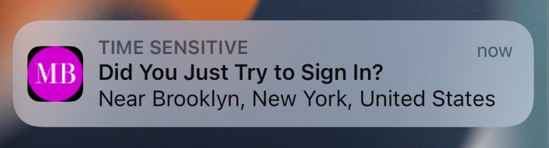

#  Okta Authenticator Sample App

This sample app demonstrates how to integrate [Okta Devices SDK](https://github.com/okta/okta-devices-swift) into an Xcode project.

**Table of Contents**
- [Okta Authenticator Sample App](#okta-authenticator-sample-app)
  - [Prerequisites](#prerequisites)
  - [Update Okta.plist](#update-okta.plist)
  - [Run the project](#run-the-project)
  - [Enroll the app as a custom authenticator](#enroll-the-app-as-a-custom-authenticator)
  - [Verify it works](#verify-it-works)
  
## Prerequisites
### Admin prerequisites
In order to use this project, your org's admin needs to:
1. Add an OIDC app with the proper scopes (`okta.authenticators.manage.self`, `okta.authenticators.read` and `okta.users.read.self`).
2. Create an `APNs` config.
3. Create a custom authenticator using the `APNs` config created above.

### Client prerequisites
1. Create a new App ID on your Apple Developer portal with the `App Groups`, `Push Notifications` and `Time Sensitive Notifications` capabilities enabled.
2. Install [CocoaPods](http://cocoapods.org)

## Update Okta.plist
This SDK needs an access token to authenticate with backend API calls. For this sample app we're using [Okta Mobile SDK](https://github.com/okta/okta-mobile-swift) for signing-in and obtaining access token. Before signing in, you need to create your client configuration using the settings defined in your application in the Okta Developer Console. The simplest approach is to use a `Okta.plist` configuration file to specify these settings.

Locate `Okta.plist` file and update the following values:
1. `{clientId}` - OIDC Client ID.
2. `{issuer}` - App's domain supporting oAuth2 `(https://{myDomain}.com`)
3. `{redirectUri}` - Redirect URI configured on your app.
4. `{logoutRedirectUri}` - Logout Redirect URI configured on your app.

## Run the project
1. Open your Terminal and change to the directory where the `podfile` is located:
    ```ruby
    cd Examples/PushSampleApp/
    ```
    Then type:
    ```ruby
    pod install
    ```

2. Open `SampleApp.xcworkspace` file.

3. Open Project Settings and change the Bundle Identifier to the App ID you previously created, this has to match the BundleID you specified on your Okta Admin portal.

4. Open `Signing and Capabilities` tab and add a new App Group (e.g. `group.com.okta.SampleApp`).

    If your App Group is other than `group.com.okta.SampleApp`, open `AppDelegate.swift` file and replace `applicationGroupID` constant with your own App Group.

5. Build and run the project. Keep in mind you need a **real device** 📲 for Push Notifications to work.

## Enroll the app as a custom authenticator

In order to try the SDK capabilities, you need to Sign In on the app with your org's credentials.

Once signed in, tap the Settings button at the top-right corner and enable the `Sign in with push notification` toggle. This will call the SDK and initiate the enrollment in order to set up your device as push authenticator. If everything succeeded you will get a success alert.

## Verify it works
On a browser, try to log in on your org's website and select your Custom Push Authenticator method. You will receive a Push Notification on your device asking you to verify your identity, similar to this:



Once tapping the notification, you will be taken to a screen to verify your identity. Tapping `Yes, it's me` will invoke the SDK and proceed to your org's signed in flow.

If you want to enable biometrics for verification, toggle the "Enable biometrics" option. This will ask you to verify with FaceID or TouchID next time you try to sign in with a Push Notification. 

### Push delivery issues
If for some reason there's an issue receiving push notifications, the SDK (and therefore this app) is able to pull pending challenges everytime the app is foregrounded. If there's a pending challenge, simply open the app and you will be asked for verification.


## Implementing the SDK on your Project
1. `NSFaceIDUsageDescription` key

    Add this key to your app's `Info.plist` in order to enable Biometrics for User Verification. Failure to do this will result in your app being terminated with a `__CRASHING_DUE_TO_PRIVACY_VIOLATION__` crash. 

2. `apsEnvironment`

    This sample app uses the `APSEnvironment.debug` config when initializing this SDK. Make sure to use `.production` for your production build accordingly.
