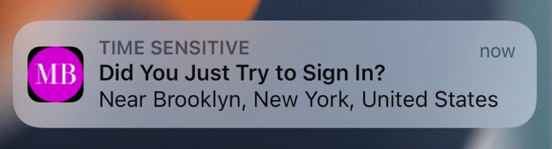

#  Okta Authenticator Sample App

This sample app demonstrates how to integrate OktaDeviceSDK into an Xcode project.

**Table of Contents**
- [Okta Authenticator Sample App](#okta-authenticator-sample-app)
  - [Prerequisites](#prerequisites)
  - [Updating Okta.plist](#updating-plist)
  - [Running the project](#running)
  - [Enrolling the app as a Custom Authenticator](#enrolling)
  
## Prerequisites
In order to use this project, your org's admin needs to:
1. Add an OIDC app with the proper scopes (`okta.authenticators.manage.self`, `okta.authenticators.read` and `okta.users.read.self`).
2. Create an `APNS` config.
3. Create a Custom Authenticator using the `APNS` config created above.

### Client prerequisites:
4. Create a new App Group on your Apple Developer portal (e.g. `group.com.okta.SampleApp`).
5. Create a new App ID with the App Groups capability enabled and the app group previously created associated to this App ID.
6. Install [CocoaPods](http://cocoapods.org)

## Updating Okta.plist
Locate `Okta.plist` file and update the following values:
1. `{clientId}` - OIDC Client ID.
2. `{issuer}` - App's domain supporting oAuth2 `(https://{myDomain}.com`)
3. `{redirectUri}` - Redirect URI configured on your app.
4. `{logoutRedirectUri}` - Logout Redirect URI configured on your app.

## Running the project
1. Open your Terminal and type
```ruby
pod install
```

2. Open the project settings and change the Bundle Identifier to the App ID you previously created, this has to match the BundleID you specified on your Okta Admin portal.

3. Open `Signing and Capabilities` tab and add the App Group you previously created.

4. If your App Group is other than `group.com.okta.SampleApp`, open `AppDelegate.swift` file and set `applicationGroupID` constant with your own App Group.

4. Open `SampleApp.xcworkspace` and run the project on a **real device** 📲, in order for Push Notifications to work.

## Enrolling this App as a Custom Authenticator

In order to try the SDK capabilities, you need to Sign In on the app with your org's credentials.

Once signed in, tap the Settings button at the top-right corner and enable the `Sign in with push notification` toggle. This will call the SDK and initiate the enrollment in order to set up your device as push authenticator. If everything succeeded you will get a success alert.

## Verifying it works
On a browser, try to log in on your org's website and select your Custom Push Authenticator method. You will receive a Push Notification on your device asking you to verify your identity, similar to this:


Once tapping the notification, you will be taken to a screen to verify your identity. Tapping `Yes, it's me` will invoke the SDK and proceed to your org's signed in flow.


If you want to enable biometrics for verification, toggle the "Enable biometrics" option. This will ask you to verify with biometrics (FaceID or TouchID) next time you try to sign in with a Push Notification. 
